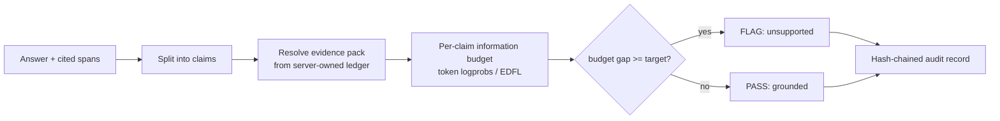
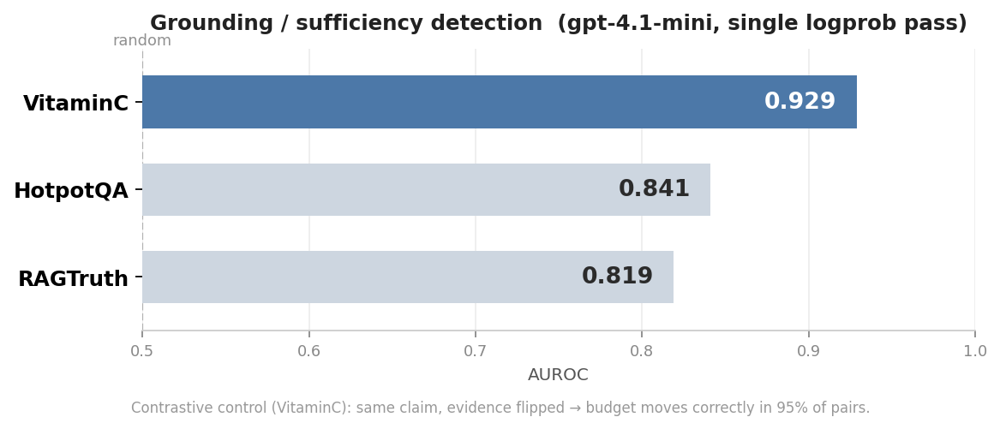

# Berry

[](https://github.com/leochlon/hallbayes/actions/workflows/ci.yml)

Berry is a local MCP server that checks whether an LLM's answer is supported by the evidence it cites. For each claim it measures how much the prediction depends on the cited evidence (an information-budget test), returns a fail-closed answer/flag decision against a target, and records every decision in a tamper-evident ledger.

It flags unsupported claims at 0.82 to 0.93 AUROC across grounding benchmarks, in a single logprob pass. It runs alongside Cursor, Codex, Claude Code, and Gemini CLI via config files committed to your repo.

## The problem

Agents assert things their context does not support. A claim can be true in the world yet ungrounded in the evidence the model was given, and world-truth fact-checkers miss exactly that case. Berry measures grounding directly: the information sufficiency of the cited evidence for each claim.

## Quickstart

```bash
pipx install -e .   # install
berry init          # in each repo: provisions a key, writes MCP + skill configs
```

Then reload MCP servers in your client. To use your own key or a different backend, run `berry setup`.

## Usage

Your agent calls `detect_hallucination` with an answer and the evidence spans it cites; Berry scores each claim and flags the ones the evidence does not support. A real run:

> **Evidence (S1):** "The James Webb Space Telescope launched on 25 December 2021 and observes primarily in infrared light."
>
> **Answer:** "JWST launched in December 2021 [S1]. It is the largest optical telescope in space [S1]."

| Claim | Decision | Budget gap |
|---|---|---|
| JWST launched in December 2021 | PASS (grounded) | -18.4 bits |
| It is the largest optical telescope in space | FLAG (not entailed) | +37.6 bits |

The first claim is entailed by S1; the second is not (S1 says infrared, not "largest"), so Berry flags it. A negative budget gap means the evidence carries the claim; a positive gap means it does not.

## How it works



- **Verifier**: `detect_hallucination` / `audit_trace_budget` (and run-scoped variants) score each claim's grounding budget in bits and decide answer vs flag against a prespecified target.
- **Span ledger**: typed, immutable, provenance-bearing evidence spans; the verifier scores spans resolved from the server-owned ledger, not caller-supplied text.
- **Claim/evidence graph**: `create_claim`, `link_claim_evidence`, `audit_claims`, `list_audits`; `supports`/`contradicts` edges must point at citable evidence.
- **Tamper-evident SQLite ledger**: incremental, hash-chained writes (O(1) per span); load replays the event chain and fails closed on any row, metadata, or chain mismatch.

Each run is one auditable artifact under `~/.berry/runs/<id>/`:

```text
run.sqlite           source of truth: spans, claims, audits, hash-chained events
ledger_events.jsonl  the append-only event log
run.json, *.tsv      inspection exports (evidence, attempts, claims, audits)
```

## Benchmarks

Information-sufficiency / grounding detection: does Berry flag claims the cited evidence does not support? Single logprob pass, `gpt-4.1-mini`.



| Dataset | What it measures | AUROC | Recall |
|---|---|---|---|
| VitaminC (SUPPORTS vs NEI) | evidence sufficiency, contrastive | **0.929** | 0.93 |
| HotpotQA (gold vs distractor) | sufficiency, controlled ablation | 0.841 | 0.975 |
| RAGTruth (atomic claims) | grounding on real RAG outputs | 0.819 | 0.884 |

Recall is the fraction of unsupported claims flagged at the default 0.95 target.

**Contrastive control (VitaminC):** hold the claim fixed and change only the evidence. Berry's budget moves in the correct direction in **95%** of paired claims (369/390). The claim is identical, so this isolates evidence sufficiency, not correctness or prior plausibility.

**Ledger:** incremental writes are **~0.15 ms/span and flat** (O(1)), about 25× faster than a full-snapshot JSON store at 600 spans, and they do not degrade as runs grow; span-row and event-chain edits fail closed on load.

Numbers are pilots on `gpt-4.1-mini`, which runs both the atomic decomposition and the verification; a stronger reasoning model (Claude Opus or an o-series thinking model) is expected to lift the RAGTruth recall, where the misses are plausible additions in long responses. The default target is recall-first, so pick an operating point from the risk-coverage curve. Full methodology, baselines, and reproduce steps in [`bench/BENCHMARK.md`](bench/BENCHMARK.md).

## Supported verifier backends

The verifier requires token logprobs (Chat Completions-style `logprobs` + `top_logprobs`).

- `openai` (default): OpenAI-compatible Chat Completions with logprobs (OpenAI, OpenRouter, local vLLM, or any compatible `base_url`)
- `gemini`: Gemini Developer API `generateContent` with token logprobs
- `vertex`: Vertex AI `generateContent` (Gemini) with token logprobs
- `dummy`: deterministic offline backend for tests/dev
- Anthropic is not supported yet (the OpenAI-compat layer drops `logprobs`)

## Workflow playbooks

Each playbook has a before/after worked example (uncited output vs evidence-backed + verifier):

- `docs/workflows/README.md`: Search & Learn, Generate Boilerplate/Content, Inline Completions, Greenfield Prototyping, RCA Fix Agent

## Docs

- `docs/USAGE.md`: task-oriented guides
- `docs/CLI.md`: command reference
- `docs/INSTALL.md`: multi-platform assistant installer
- `docs/CONFIGURATION.md`: config files, defaults, env vars
- `docs/MCP.md`: tools, prompts, transport
- `docs/SPANS.md`: span-ledger model, incremental SQLite/event-log persistence, claim/evidence graph, evidence-pack policy
- `docs/PACKAGING.md`: release pipeline

## Tests

```bash
pytest
```
